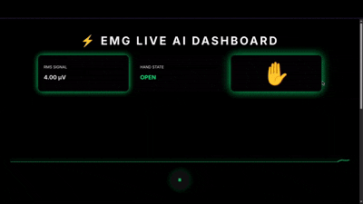

# 🧠 EMG Hand Movement Detector with Transformer Model

Real-time hand gesture detection system using electromyography (EMG) signals, powered by a hybrid CNN-Transformer deep learning model.

[](https://www.gnu.org/licenses/gpl-3.0)
[](https://www.python.org/downloads/)
[](https://reactjs.org/)

 <!-- Add a demo GIF/screenshot if you have one -->

## 🌟 Features

- **Real-time EMG Signal Processing**: 500Hz sampling with adaptive baseline RMS detection
- **Dual Detection System**:
  - 🔴 **RMS-based Detection**: Fast, threshold-based clench detection with hysteresis
  - 🧠 **AI-Powered Analysis**: Deep learning model (CNN + Transformer) for gesture classification
- **Live Visualization**: Real-time waveform display with color-coded hand states
- **6 Real-time Metrics**:
  - AI Gesture Confidence
  - Neural Activation
  - Signal Stability
  - Response Sharpness
  - Muscle Consistency
  - Responsiveness
- **Web-Based Interface**: Built with React for smooth, interactive UI
- **In-Browser AI Inference**: ONNX Runtime Web enables client-side model execution

## 🏗️ System Architecture
```
Arduino (EMG Sensor) → Serial (500Hz) → Python Backend → HTTP API → React Frontend
                                              ↓
                                        AI Model (ONNX Runtime Web)
```

### Components:
1. **Hardware**: Muscle BioAmp Candy sensor + Arduino Uno
2. **Backend**: Python Flask server with real-time signal processing
3. **AI Model**: Hybrid CNN-Transformer (PyTorch → ONNX)
4. **Frontend**: React app with ONNX Runtime Web for in-browser inference

## 📊 Model Architecture

**Hybrid CNN + Transformer** (~400K parameters)
```
Input (256 samples, 0.5s window @ 500Hz)
    ↓
CNN Feature Extractor (2 Conv blocks: 1→32→64 channels)
    ↓
Positional Encoding (learned)
    ↓
Transformer Encoder (2 layers, 8 attention heads, d_model=64)
    ↓
Classification Head (64→32→1 with Sigmoid)
    ↓
Output (Gesture probability 0-1)
```

**Performance**: 75.8% validation accuracy on 13 subjects, 13,000 samples

## 🚀 Quick Start

### Prerequisites

- Python 3.8+
- Node.js 16+
- Arduino IDE
- Muscle BioAmp Candy EMG Sensor

### 1. Hardware Setup

1. Connect Muscle BioAmp Candy sensor to Arduino:
   - OUT → A0
   - VCC → 5V
   - GND → GND

2. Upload Arduino code:
```bash
cd backend/emg_envelope_stream
# Open emg_envelope_stream.ino in Arduino IDE and upload
```

3. Note your Arduino's serial port (e.g., `/dev/ttyUSB0` or `COM3`)

### 2. Backend Setup
```bash
# Clone repository
git clone https://github.com/hrishi63/HAND_MOVEMENT_DETECTOR_USING_EMG_WITH_TRANSFORMER_MODEL.git
cd HAND_MOVEMENT_DETECTOR_USING_EMG_WITH_TRANSFORMER_MODEL

# Create virtual environment
python3 -m venv venv
source venv/bin/activate  # On Windows: venv\Scripts\activate

# Install dependencies
pip install -r requirements.txt

# Update serial port in backend/server.py (line 12)
# ser = serial.Serial('/dev/ttyUSB0', 115200)

# Start backend server
cd backend
python server.py
```

Server will run on `http://localhost:5000`

### 3. Frontend Setup
```bash
cd frontend

# Install dependencies
npm install

# Model files are already in frontend/public/model/
# - emg_transformer_web.onnx
# - emg_transformer_web.onnx.data

# Start development server
npm start
```

App will open at `http://localhost:3000`

**See `quicksetup.txt` for detailed setup instructions!**

## 🎮 Usage

1. **Attach EMG sensor** to your forearm (muscle belly, not tendon)
2. **Calibrate** by relaxing for 3 seconds
3. **Click Play** ▶️ to start monitoring
4. **Clench your fist** and watch real-time metrics update
5. **View AI analysis** in the bottom panel

### Controls:
- **▶️ Play/⏸️ Pause**: Start/stop real-time monitoring
- **Gesture Cycles**: Counts open → clenched transitions

## 📁 Project Structure
```
HAND_MOVEMENT_DETECTOR_USING_EMG_WITH_TRANSFORMER_MODEL/
├── backend/
│   ├── emg_envelope_stream/
│   │   └── emg_envelope_stream.ino  # Arduino firmware
│   ├── server.py                    # Flask server with signal processing
│   ├── train_model.py               # Model training script
│   ├── model.py                     # Model architecture definition
│   └── export_working.py            # ONNX export script
├── frontend/
│   ├── src/
│   │   ├── components/
│   │   │   ├── EMGHandVisualizer.jsx  # Main visualizer
│   │   │   └── AIAnalyzer.jsx         # AI metrics panel
│   │   └── App.js
│   └── public/
│       └── model/                     # ONNX model files
│           ├── emg_transformer_web.onnx
│           └── emg_transformer_web.onnx.data
├── dataset/                           # Training data (download separately)
├── requirements.txt
├── quicksetup.txt
└── README.md
```

## 📊 Dataset

The training dataset is available on Kaggle:

**[Open/Close Fist State EMG Signal Envelope Dataset](https://www.kaggle.com/datasets/nveshaan/openclose-fist-state-emg-signal-envelope)**

- **13 subjects**
- **~13,000 samples**
- **256-sample windows** (0.5s @ 500Hz)
- **Binary labels**: 0 = open hand, 1 = clenched fist

### Download & Prepare:
```bash
# Download from Kaggle and extract to dataset/
# Should contain X0.npy to X12.npy and Y0.npy to Y12.npy

# Verify dataset
ls dataset/
# Expected: X0.npy, X1.npy, ..., X12.npy, Y0.npy, Y1.npy, ..., Y12.npy
```

## 🧪 Training Your Own Model

### 1. Prepare Dataset

Download the dataset from Kaggle (link above) and place in `dataset/` folder.

Dataset format:
- `X0.npy` to `X12.npy`: EMG windows (shape: [N, 256])
- `Y0.npy` to `Y12.npy`: Labels (0=open, 1=clenched)

### 2. Train Model
```bash
cd backend
python train_model.py
```

Training configuration:
- **Batch size**: 32
- **Epochs**: 50 (with early stopping, patience=15)
- **Optimizer**: AdamW (lr=1e-3, weight_decay=1e-4)
- **Scheduler**: Cosine annealing
- **Augmentation**: Random scaling (0.85-1.15x), Gaussian noise, time shifts
- **Loss**: Binary Cross-Entropy (BCE)
- **Train/Val split**: 85% / 15%

Output: `emg_transformer_real.pth` (saved model checkpoint)

**Expected results:**
- Training accuracy: ~80-85%
- Validation accuracy: ~75-80%

### 3. Export to ONNX
```bash
cd backend
python export_working.py
```

Creates:
- `emg_transformer_web.onnx` (model graph)
- `emg_transformer_web.onnx.data` (weights, ~450KB)

Copy both files to `frontend/public/model/` for deployment.

## 📈 Metrics Explained

| Metric | Calculation | Physical Meaning | Good Range |
|--------|-------------|------------------|------------|
| **AI Confidence** | Model output aligned with RMS state | AI's certainty in gesture classification | 70-100% |
| **Neural Activation** | `(mean_abs_amplitude / 30) × 100` | Overall muscle electrical activity level | 70-100% when clenched |
| **Signal Stability** | `100 - (CV × 50)` | Signal consistency (lower tremor/noise) | 70-100% |
| **Response Sharpness** | `(peak_to_peak / 100) × 100` | Strength of muscle activation | 70-100% when clenched |
| **Muscle Consistency** | `100 / (1 + variance/10)` | Pattern repeatability | 70-100% |
| **Responsiveness** | `mean_derivative × 20` | Speed of muscle response | 40-70% |

**Color coding:**
- 🟢 **Green (70-100%)**: Excellent
- 🟠 **Orange (40-70%)**: Moderate
- 🔴 **Red (0-40%)**: Poor

## 🔧 Troubleshooting

### Model won't load in browser
- ✅ Ensure **both** `.onnx` and `.onnx.data` files are in `frontend/public/model/`
- ✅ Check browser console (F12) for specific errors
- ✅ Verify files are accessible: `http://localhost:3000/model/emg_transformer_web.onnx`
- ⚠️ Clear browser cache and restart React app

### Serial connection fails
- Check Arduino is connected: `ls /dev/tty*` (Linux/Mac) or Device Manager (Windows)
- Verify correct port in `backend/server.py` line 12
- Try different baud rates (115200 recommended)
- **Linux**: Add user to `dialout` group: `sudo usermod -a -G dialout $USER` (logout/login required)
- **Windows**: Install CH340 drivers if using cheap Arduino clones

### Poor detection accuracy
- ✅ Place sensor on **muscle belly** (not tendon or bone)
- ✅ Clean skin with alcohol wipe before application
- ✅ Ensure firm electrode contact
- ⚙️ Adjust RMS threshold in `backend/server.py` line 28
- 🔄 Recalibrate by relaxing hand for 3 seconds
- 📊 Check signal quality in frontend waveform

### High latency / Lag
- 🔧 Reduce Arduino serial buffer if needed
- 💻 Check CPU usage (transformer inference can be intensive)
- ⚡ Lower frontend polling rate in `AIAnalyzer.jsx` line 171 (increase interval from 400ms)
- 🌐 Use Chrome/Edge for better WebAssembly performance

### ONNX Runtime errors
- Update to latest Chrome/Edge browser
- Check console for "initWasm() detected" error - this is fixed in current code
- Ensure `onnxruntime-web` is installed: `cd frontend && npm list onnxruntime-web`

## 🛠️ Technologies Used

### Hardware
- **EMG Sensor**: Muscle BioAmp Candy (Upside Down Labs)
- **Microcontroller**: Arduino Uno
- **Connection**: USB Serial (115200 baud)

### Backend
- **Python 3.8+**
- **Flask**: Web server
- **PySerial**: Arduino communication
- **PyTorch**: Model training
- **ONNX**: Model export

### Frontend
- **React 18**: UI framework
- **ONNX Runtime Web**: In-browser inference
- **JavaScript**: Real-time visualization

### Machine Learning
- **Architecture**: Hybrid CNN + Transformer
- **Framework**: PyTorch
- **Deployment**: ONNX format for cross-platform inference

## 📝 Technical Details

### Signal Processing Pipeline:
1. **Hardware filtering** (Muscle BioAmp Candy): Bandpass filter (72-720 Hz) + envelope detection
2. **Digital sampling**: Arduino reads at 500Hz, streams via serial
3. **Backend processing**: 
   - RMS calculation with rolling 20-sample window
   - Adaptive baseline tracking (exponential moving average)
   - Hysteresis thresholding (prevents flickering)
4. **AI inference**: 256-sample windows (0.5s) every 400ms
5. **Frontend rendering**: Real-time waveform + metrics display

### Model Architecture Details:
- **Total parameters**: ~400,000
- **Input**: 256 float32 values (z-score normalized)
- **Output**: Single probability (0-1)
- **Inference time**: ~20-50ms in browser (WASM)
- **Model size**: 0.24 MB (.onnx) + 0.45 MB (.data)

### RMS Detection Algorithm:
```python
# Adaptive baseline with hysteresis
baseline = baseline * 0.99 + rms * 0.01  # Exponential moving average
threshold = baseline * 2.5

if rms > threshold and not is_clenched:
    if rms > threshold * 1.1:  # Upper hysteresis
        is_clenched = True
elif rms < threshold * 0.8:    # Lower hysteresis
    is_clenched = False
```

## 🤝 Contributing

Contributions welcome! Please:

1. Fork the repository
2. Create a feature branch (`git checkout -b feature/amazing-feature`)
3. Commit changes (`git commit -m 'Add amazing feature'`)
4. Push to branch (`git push origin feature/amazing-feature`)
5. Open a Pull Request

**Areas for improvement:**
- [ ] Add more gesture types (peace sign, point, etc.)
- [ ] Implement muscle fatigue detection
- [ ] Add data collection UI
- [ ] Support multiple EMG channels
- [ ] Mobile app version
- [ ] Real-time model fine-tuning

## 📄 License

This project is licensed under the **GNU General Public License v3.0** - see the [LICENSE](LICENSE) file for details.

This means you are free to:
- ✅ Use the software for any purpose
- ✅ Change the software to suit your needs
- ✅ Share the software with others
- ✅ Share the changes you make

Under the conditions:
- ⚠️ Disclose source code
- ⚠️ License and copyright notice
- ⚠️ Same license (GPL-3.0)
- ⚠️ State changes

## 🙏 Acknowledgments

- **Dataset**: Collected from 13 volunteer subjects ([Kaggle Dataset](https://www.kaggle.com/datasets/nveshaan/openclose-fist-state-emg-signal-envelope))
- **Hardware**: Muscle BioAmp Candy by [Upside Down Labs](https://upsidedownlabs.tech/)
- **Inspiration**: Research in EMG-based Human-Computer Interaction
- **Community**: Open-source contributors and testers

## 🔗 Links

- **Repository**: [https://github.com/hrishi63/HAND_MOVEMENT_DETECTOR_USING_EMG_WITH_TRANSFORMER_MODEL](https://github.com/hrishi63/HAND_MOVEMENT_DETECTOR_USING_EMG_WITH_TRANSFORMER_MODEL)
- **Dataset**: [Kaggle - Open/Close Fist EMG Dataset](https://www.kaggle.com/datasets/nveshaan/openclose-fist-state-emg-signal-envelope)
- **Muscle BioAmp Candy**: [Upside Down Labs](https://upsidedownlabs.tech/product/bioamp-candy/)

## 📧 Contact

Project Maintainer: [@hrishi63](https://github.com/hrishi63)

---

⭐ **Star this repo if you found it useful!**

🐛 **Found a bug?** [Open an issue](https://github.com/hrishi63/HAND_MOVEMENT_DETECTOR_USING_EMG_WITH_TRANSFORMER_MODEL/issues)

💡 **Have an idea?** [Start a discussion](https://github.com/hrishi63/HAND_MOVEMENT_DETECTOR_USING_EMG_WITH_TRANSFORMER_MODEL/discussions)
